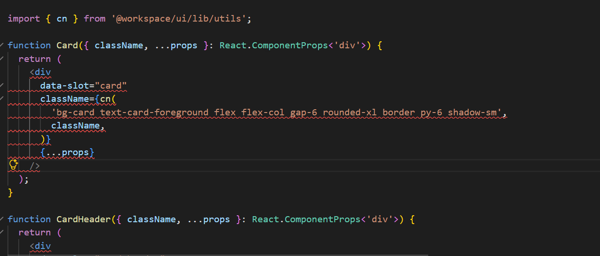
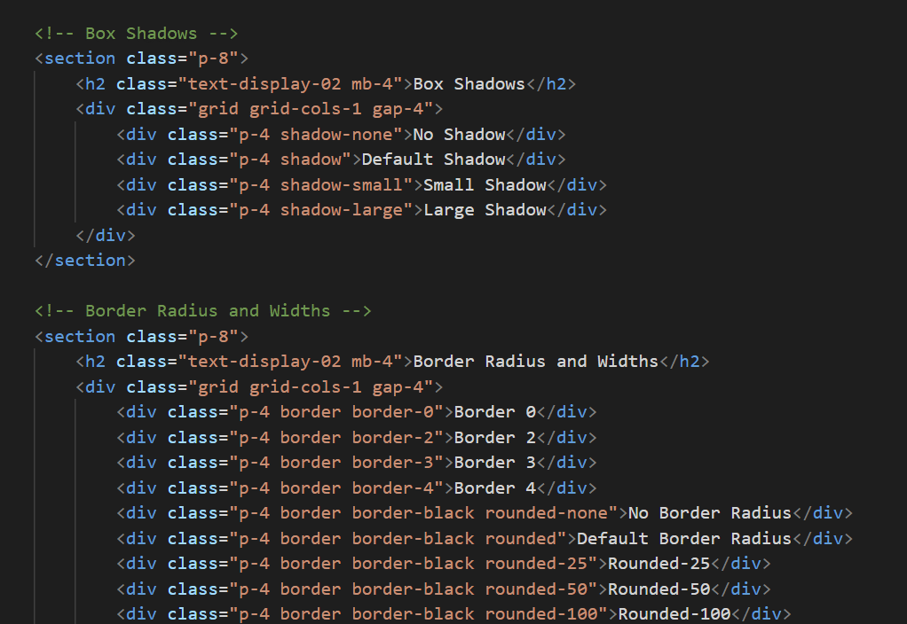

[](https://marketplace.visualstudio.com/items?itemName=ltns.theme-lens-core)


# ThemeLens for Tailwind

Hover a preview of custom Tailwind classes and see the underlying CSS values used in your theme.
## What it does

ThemeLens shows your custom Tailwind theme tokens on hover.  Works with both Tailwind v3 and v4.
## Features



- Hover previews for custom classes and theme tokens
- Tailwind v3 and v4 support, including `@theme` block parsing

## Installation

**From the VS Code Marketplace:**

1. Open the Extensions panel in VS Code (`Ctrl+Shift+X` / `Cmd+Shift+X`)
2. Search for "ThemeLens"
3. Click Install

**Or via command line:**

```
code --install-extension <publisher>.theme-lens
```

## Usage

Hover over any custom Tailwind class in your code to see its underlying token value.

#### v3


#### v4


## Configuration

No configuration needed — ThemeLens works out of the box.

## Known Issues

Token values defined as functions, or values that reference another token via `theme()`aren't supported yet. The hover will skip it. 

## Contributing

Issues and PRs are welcome. No formal contribution process yet. Feel free to open an issue to discuss changes.

## License

MIT